The Royal Tasmanian Botanical Gardens is Australia’s cool climate garden, with a number of unique collections including Australia’s only Subantarctic Plant House. With a total of 14 hectares to explore, visitors can take time to relax and explore or tailor a walk based on personal interest. Established in the early years of the colony of Hobart, the rich history of the gardens is evident throughout the site, and it is Australia’s second oldest Botanic Gardens, established just two years after Sydney.

We didn't have much time, so we focused on the top ten locations as described by the guide brochure.

## The Entrance

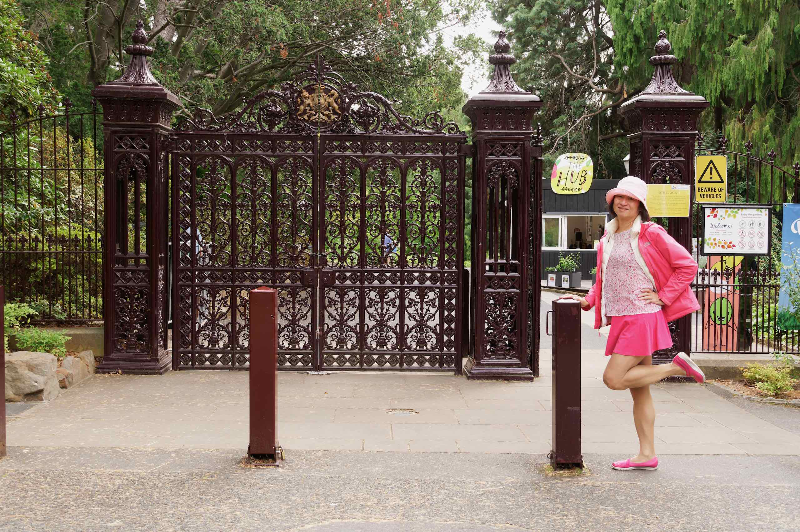

The old entrance was a simple green door, allowing one person at a time. The (new) cast-iron entrance gates were installed in 1878. The avenue in front of the gates (now a car park) enlarges to a rough circle of 80 feet – the turning circle of a coach and pair of horses. The double gates were made wide enough to enable carts to pass through. The old green door (still green), remains in place and is used with surprising frequency.

Even by Victorian standards the gates are imposing in height and solidity: the cast-iron has been decorated with what seems like a Bacchanalia; gods and grapes being in liberal supply. The coat of arms of the Royal Society decorates the top of the paired main gates, and there is a smaller pedestrian entrance: a much more recent and simpler iron fence flanks either side, joining with the Arthur Wall and the main fence by the road. Painted currently a dark maroon, they certainly improve the atmosphere as one walks up the avenue.

## Gatekeepers Cottage

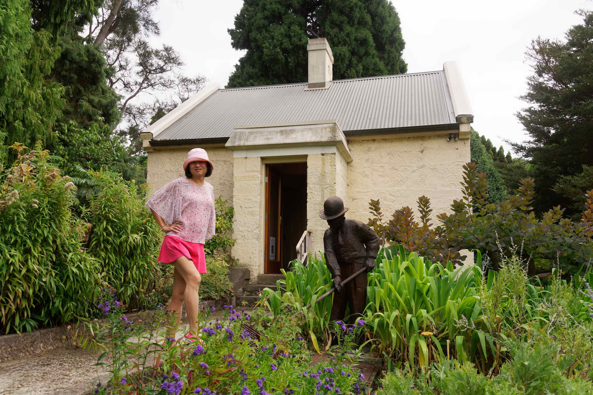

Designed by the Colonial Architect, Porden Kay, this house (originally intended for the Superintendent) was situated near the northern end of the Arthur Wall, and initially had two rooms and kitchen downstairs, with a (very) steep stairway to a small attic.

It appears never to have been occupied by any of the Superintendents, though it was certainly well-used. In its time it was home to an Overseer / gatekeeper, served as a porter’s Lodge and Tea Rooms. It then received extensions which allowed it to be used by the Board of Trustees and finally as the Administration building, with offices, library, Herbarium and Friends’ shop. It seems unnecessary to add that these extensions transformed an attractive stone cottage into a medley of discordant parts. Thankfully, it was restored to almost original condition in 1999. Today it is heritage listed.

## Lily Pond

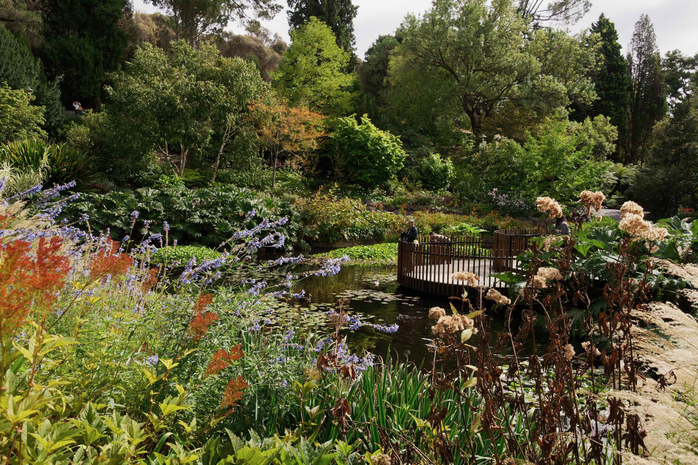

This area has a long history at the gardens. This popular garden area has evolved from its initial functional use as a reservoir collecting rainfall runoff from the Domain in 1848, to being a display garden largely of water loving perennial plants surrounded by large established conifers from early planting of the Gardens in 1870.

We marveled at the monstrous leaves of Gunnera manicata, the winter sweet smelling Luculia pinceana, and the water lilies that the ducklings scoot over.

A platform over the pond and the bridge allowed us to get close to the water and enjoy the garden from differing vantage points.

## Tasmanian Plant Collection

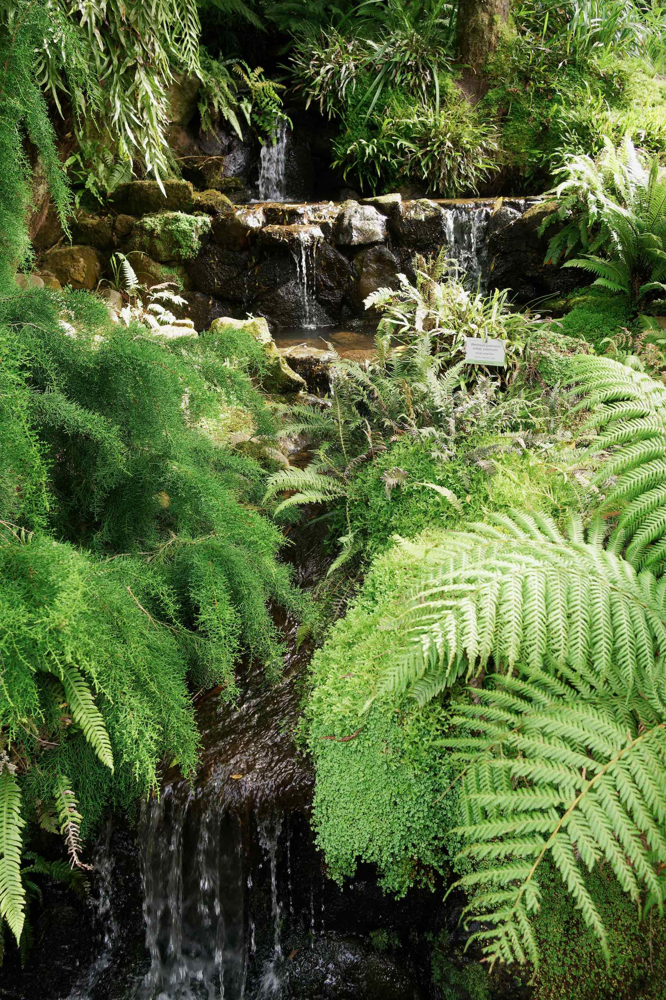

This garden was established in 1991 in recognition of the need to develop an area dedicated to the display of Tasmanian Native plants within the RTBG.

The current Fernery was constructed in 1964, replacing an earlier one on the south side of the lily pond. It was designed by then Gardens Superintendent, Walter Tobias, and modified in 1974 when the cascading watercourse was created.

## Anniversary Arch

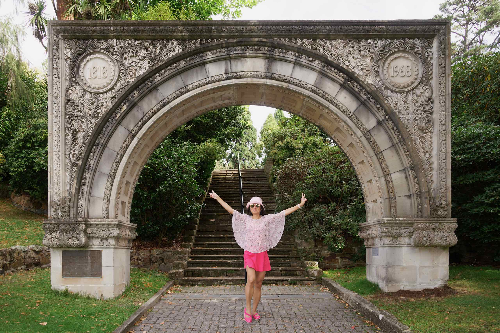

This romantic carved arch is set at the base of stone steps surrounded by tall shady trees and shrubs.

The arch was originally constructed in 1913 to span the entrance of the AMP Society’s original Elizabeth Street building. When that building was demolished, AMP donated the arch to the Gardens. It was re-erected in 1968 in time for celebrations of the Gardens’ 150th Anniversary.

## Floral Clock

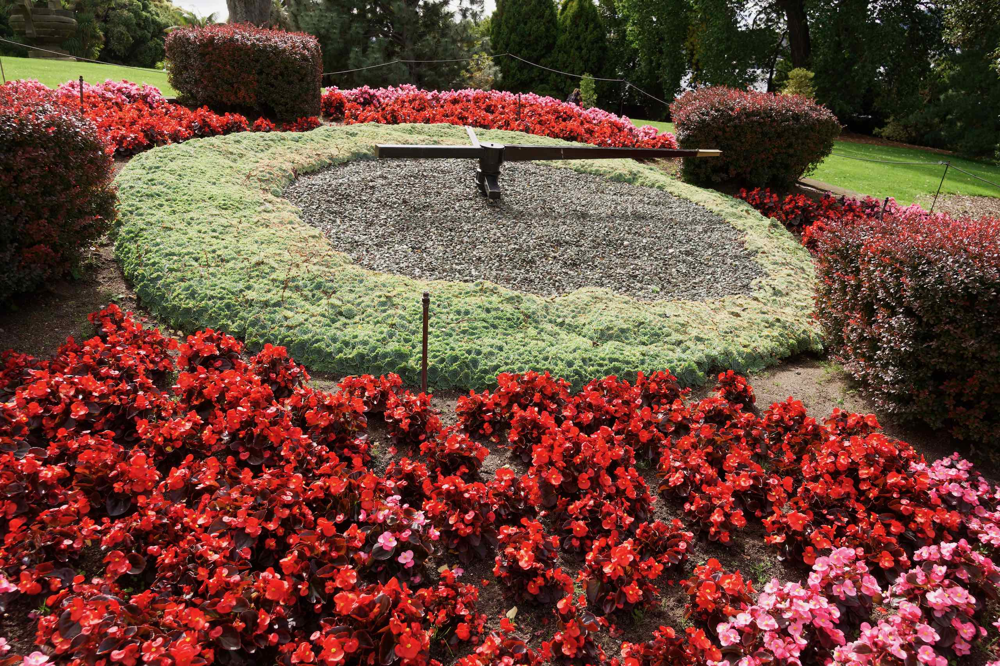

This is an attractive clock decorated with bright flowers.

## The Conservatory

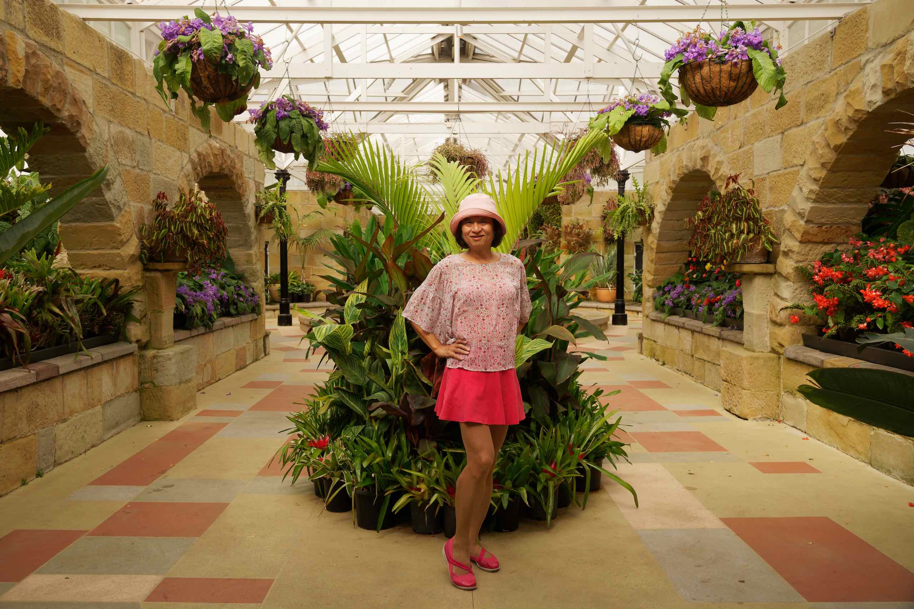

The Conservatory was designed by Superintendent Ira Thornicroft, and completed in 1939. Its walls are built of sandstone salvaged from a demolished section of the Hobart General Hospital. There is a sandstone fountain at the centre.

## French Explorers garden

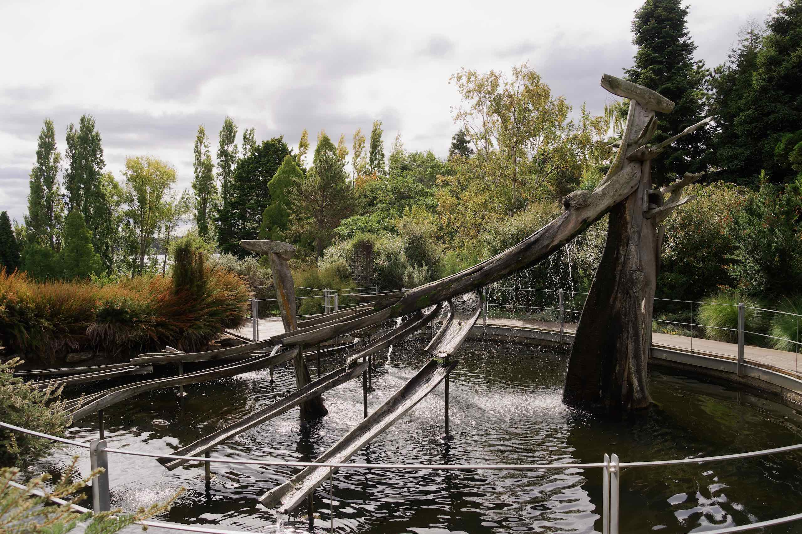

The prominent feature of this garden is the French memorial fountain - an “Antipodean Voyage.”

The French Memorial Fountain is a significant sculptural element in the Gardens. It represents the bow and sails of an early French sailing ship, and was erected in 1972 to mark the bicentenary of the first of a number of French voyages of discovery that visited Tasmania from 1792.

The fountain was designed and constructed by the well-respected Australian artist Stephen Walker whose many other creative and beautifully detailed works can also be seen in other parts of Hobart and Tasmania, including the well-known bronze Bernacchi Tribute on the Hobart waterfront.

## Japanese Garden

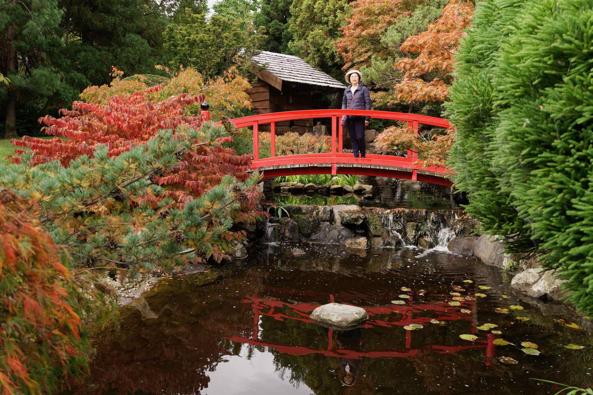

The Japanese garden was designed by Kanjiro Harada, a landscape architect from Yaizu, Japan, Hobart’s sister city. The Garden officially opened in 1987. It emphasises traditional Japanese garden elements of wood, stone and water. This project involved a reciprocal Australian garden design project for Hobart’s Japanese sister city. The plants in the Garden largely consist of species native to Japan and selected cultivars, with Japanese maples a feature, particularly in autumn. The waterway with its associated tea house, waterwheel and bridges, acts as a focal point for the central plantings.

It’s beautiful in every season, with cherry blossom in spring then irises and water lilies in summer. The stunning Japanese maples put on a dazzling display in autumn, followed by the winter tracery of their bare branches. There are numerous conifers of all shapes, sizes and colours plus a plethora of Camellias and Azaleas.

## Historic Eardley-Wilmot Wall

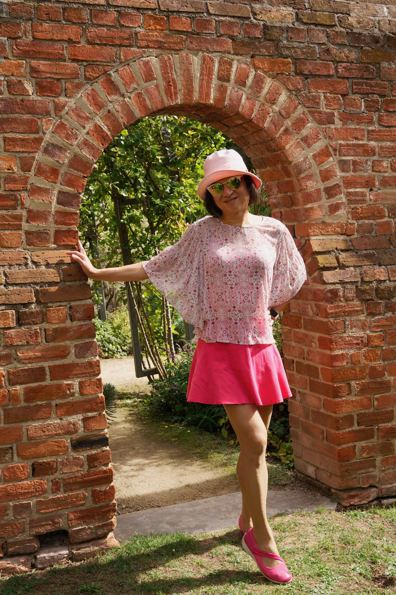

Sir John Eardley-Wilmot became Governor in 1843 and with the appointment came the responsibility for the Gardens, which were suffering badly after ten tears of neglect following Davidson’s departure.

The monument to his tenure is seen in the 4 metre / 12-feet high convict-built brick wall, which stretches 280 metre /400 feet north–south across the Gardens, supported by numerous buttresses. It also extends in an east–west axis and finishes to the rear of the Administration building. The use of convict labour for this project, when unemployed free men were available, caused social unrest, and his reason for construction—“to keep grasshoppers out” — was derided. The wall did however, remain as the eastern marker for the Gardens’ border for many years and for most of this time contained only one opening towards its southern end. There are now five archways through the wall.

## Tasmanian Community Food Garden

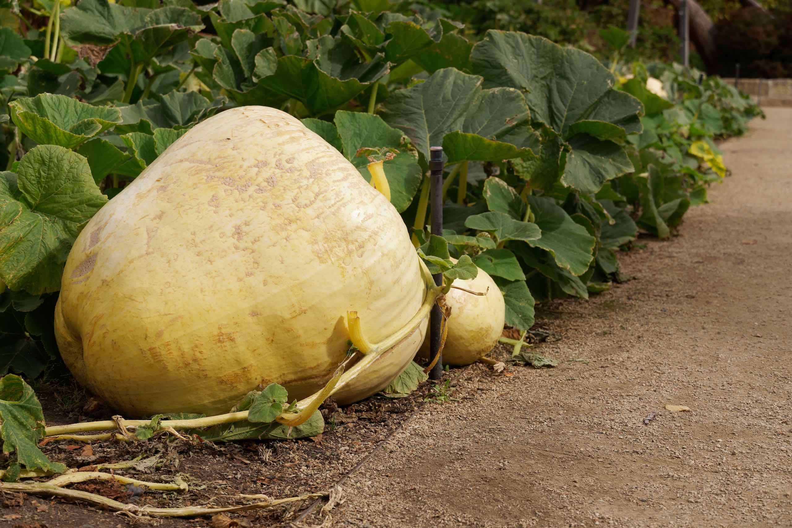

This area has a long history of cultivation as a food garden and orchard from the original Hangan’s Farm in 1806 to extensions of Government House vegetable beds until the 1950s.  In more recent times it was the Economic Garden and Pete’s Vegie Patch. All up an unbroken 200 year history of productive plantings.
Community beds.

The new Tasmanian Community Food Garden was completed in 2013 on the site of the original ‘Pete’s Patch’. This Garden is a working organic production and display garden, with a multitude of veggie production practices displayed including an example of the original six-bed crop rotation system made famous in the original patch.
